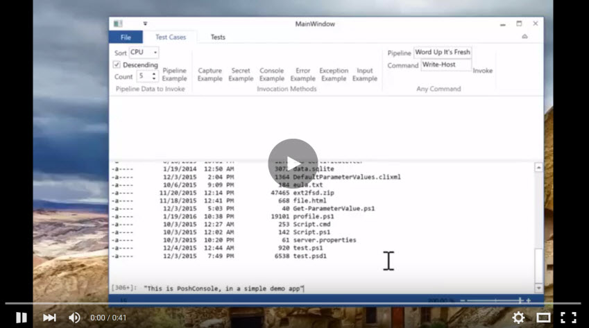

# PoshConsole

PoshConsole is a WPF control that self-hosts PowerShell.
It is the core of my framework for building PowerShell-based management applications (which is what I'm currently doing, as a consultant). 

You can install it from NuGet:

```posh
Install-Package PoshCode.PoshConsole 
```


You can use in in WPF applications as simply as placing the control in your window:

```xaml
<pc:PoshConsole xmlns:pc="http://schemas.poshcode.org/wpf/poshcode"
                x:Name="PoshConsole" />
```

By default, it adds a "Modules" subdirectory of your application root to your PSModulePath, so you can ship your own modules there, and if you leave the window visible, your users can interact with it as though it were a full-blown PowerShell console.  

Of course, what makes it interesting is that you can invoke PowerShell cmdlets from code behind as easily as this:

```csharp
PoshConsole.ExecuteCommand("Get-ChildItem");
```

And the command/script that you invoke is displayed in the console along with it's output -- so in a graphical management interface, it provides you with a way to leverage your PowerShell investment and teach your users the command-line interface at the same time.

You can easily call a command and then populate a listbox in your UI with the results (as well as displaying the command and the output in the console pane):

```csharp
PoshConsole.ExecuteCommand("Get-ADUser", onSuccessAction: users => 
    {
        Dispatcher.InvokeAsync(() => 
        {
          // Users is a collection of PSObject, let's unwrap the base objects:
          UserList.DataContext = users.Select(u => u.BaseObject);
        }
    });
```

There is, of course, much more you can do, and I'm just getting started, so there are plenty more features on the way, and I'm still debating a few of the design choices, if you'd like to voice an opinion.

[](http://www.youtube.com/embed/x6A70RRkW_Y?autoplay=1)

### A Caution:

As of this writing, I'm calling this version 0.8.5 -- until I release a 1.0, you should assume that the command API and event handlers may have breaking changes in any release. Having said that, I have been firming this up for several few months (and I have a commercial product about to be released which uses this control), so I expect the API is just about complete.

### Thanks

I'd like to thank a couple of vendors who support Open Source by letting developers use their tools for free:

[](http://www.ndepend.com/)
[](https://www.jetbrains.com/resharper/)
